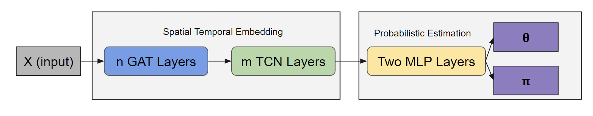

# summer-project
This is the repository for Zepu's summer project at MIT.

## Introduction
data.zip: The ride sharing dataset in New York.

GAT.py: It is an implementation of graph attention networks.

layers.py: an implementation of graph attention layers and temporal convolution layers.

main_M_Gaussian.py: an exmple of the training process of Gaussian Mixture Distribution.

test_M_Gaussian.py: an example of the testing process of Gaussian Mixture Distribution.

main_M_Poisson.py: an exmple of the training process of Poisson Mixture Distribution.

test_M_Poisson.py: an example of the testing process of Poisson Mixture Distribution.

More exmaples will be updated.

Some of the codes are from: 
https://github.com/ZhuangDingyi/STZINB

To run codes, do not forget to change data path in the main_M_Gaussian.py and test_M_Gaussian.py.

## Framework

## Summary
You might refer to my online document to (https://docs.google.com/document/d/1f_kDtgcsUErWmNqoquzOAtbmElwZ8JbT78776JuGvSM/edit?usp=sharing) for my weekly progress. This document is keeping updated.
You might refer to my online document to (https://docs.google.com/document/d/1BmTfi7_eZrvGi1OLK8uFPuJeXgG43onaVEVNfqNcssU/edit?usp=sharing) for my personal evaluation.

## Acknowledgement

THanks Prof. Jinhua Zhao, Prof. Shenhao Wang, Dingyi Zhuang and Qingyi Wang for supporting me this summer.

